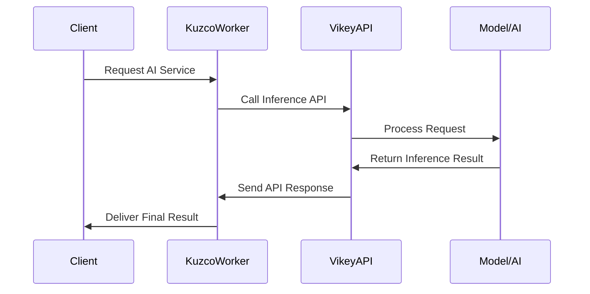

# A Comprehensive Guide - Running Kuzco Inference with CPU by API Proxy (Ollama or OpenAI)


## (1) Inferences System Data Sequence Diagram



## (2) Structure Directory

```diff
/kuzco-inference
├──.dockerignore
├──.ignore
│
├── /home
│   ├── .env
│   ├── Dockerfile
│   ├── docker-compose.yaml
│   ├── ex.nginx-conf
│   ├── execute.sh
│   └── start.sh
│
├── /vikey-inference
│   ├── .env
│   ├── Dockerfile
│   ├── docker-compose.yaml
│   ├── models.json
│   └── vikey-inference-linux            # File config binary linux (for windows request)
│
-├── /dashboard                          # Realtime monitoring run (optional)
│   ├── Dockerfile
│   ├── docker-compose.yaml
│   ├── extract_log.py
│   ├── index.html                       # Homepage (check preview)
│   ├── monitor_server.py
│   └── inference_results.json
│
└── README.md
```

## (3) Preview Kuzco Inference Dashboard

> [!NOTE]
> Check preview homepage if need run (realtime) by own-localthost [Kuzco Inference Dashboard](https://arcxteam.github.io/kuzco-inference/dashboard/)

---

## A. SETUP FOR ACCOUNT


### 1. Initial Requirements

| Requirement     | Details                |
| :----------     | :--------------------  |
| **Linux**       | Ubuntu 20 - 22 - 24 LTS          |
| **CPU**         | vCores 8 with 8GB RAM - more     |      
| **STORAGE**     | Up 50GB - more spaces            |
| **API PROXY**   | Support LLM Ollama & OpenAI      |
| **PORT**        | Open 11434 (Official API Proxy)  |
|                 | Open 14444 (Official API Kuzco)  |
|                 | Open 5050 (Custom for Dashboard) |

### 2. Registration Kuzco Inference

**Obtain correct CLI WORKER**
- Sign up here https://devnet.inference.net/register
- Navigate to [create worker](https://devnet.inference.net/dashboard/workers/create)
- Create up to you `Worker Name` → `CLI` → `Create Worker`
- Click your `Worker Name` → click `Instance` and `Launch worker` → in section Step 2: Run an instance of this worker `COPY YOUR CODE`

### 3. Registration for API Proxy
**Note, use Vikey AI**
- Need API-KEY w/ compatible format Ollama or OpenAI (LLM)
- I use `VikeyAI` for default Kuzco model `llama-3.2-3b-instruct` & more models <mark>Rp.3000-5000/1M Tokens ~ $0.18-$0.3/1M Tokens</mark>
- Readme here for detail use [bahasa indonesia](https://github.com/arcxteam/kuzco-inference/blob/main/VIKEY-ID.md)
- Readme here for detail use [languange english](https://github.com/arcxteam/kuzco-inference/blob/main/VIKEY-EN.md)

## B. SETUP FOR CONFIGURATION

### 1. Update System Packages
```bash
sudo apt update && sudo apt upgrade -y && \
sudo apt install screen curl ufw nload tree iptables git wget lz4 jq make gcc nano automake autoconf \
htop tmux libgbm1 protobuf-compiler python3 python3-pip python3-venv python3-dev python3-setuptools \
tar clang nethogs ncdu unzip build-essential pkg-config libssl-dev libleveldb-dev \
speedtest-cli ca-certificates libffi-dev libsqlite3-dev -y
```

### 2. Install v22.18 Node.js, Npm, Yarn, & Pm2 (optional)
```
source <(wget -qO- https://raw.githubusercontent.com/arcxteam/w-ai-wombo/main/nodejs.sh)
```

### 3. Install Docker & Compose → <mark>if not yet</mark>
```bash
curl -sSL https://raw.githubusercontent.com/arcxteam/succinct-prover/refs/heads/main/docker.sh | bash
```

### 4. Clone Repository & Port Firewall
```bash
git clone https://github.com/arcxteam/kuzco-inference.git
```

```bash
sudo ufw allow 11434 && sudo ufw allow 14444 && sudo ufw allow 5050 && sudo ufw reload && sudo ufw status verbose
```

> After completed all step, final config for next step run

- Setup directory `kuzco-inference/home/` **(Main Running Kuzco)**
- Setup directory `kuzco-inference/vikey-inference/` **(API Proxy Model Run)**
- Setup directory `kuzco-inference/dashboard/` **(Optional run if need realtime monitor)**

### 5. Config Account (.env)

> NOTE: RUN 1st
- First running `API Proxy LLModels`
- Replace this API KEY `VIKEY_API_KEY=vk-xxxxxxxxx`
- If success build check logs `docker compose logs` is optional

```bash
cd kuzco-inference/vikey-inference && nano .env
```

```bash
docker compose up --build -d
```

> NOTE: RUN 2nd
- Seconds need running `Main Run Kuzco with official config Binary`
- After success run above, in terminal back to `cd` and next step
- Replace this `WORKER_CODE=xxxxxxx` and `WORKER_NAME=xxxxxx` and `VIKEY_API_KEY=vk-xxxxxx`
- Where do? worker code, worker name read above <mark>**A.SETUP FOR ACCOUNT**</mark>
- If success build check logs `docker compose logs -f`

```bash
cd kuzco-inference/home && nano .env
```

```bash
docker compose up --build -d
```

### 6. Running Homepages/Dashboard

> NOTE: AFTER SUCCESS ALL DIRECTORY RUN AND STABLE GET INFERENCE INFO LOGGING, YOU CAN RUN OWN DASHBOARD MONITORING THIS ACTUAL BY YOUR RUNNING LOG
- Get ip address `curl ifconfig.me && echo`
- For access web `http://ip-address:5050`

```bash
cd kuzco-inference/dashboard && docker compose up --build -d
```

## C. USEFULL COMMANDER

```diff
# Check info logging
+ docker logs -f kuzco-inference --tail=200
+ docker compose logs -f --tail=200

# Stop & up, Go to each directory
+ cd kuzco-inference/home
+ cd kuzco-inference/dashboard
+ cd kuzco-inference/vikey-inference
+ docker compose down -v
+ docker compose up --build -d

# Delete total image build and clean
+ docker rmi home-kuzco-main:latest && docker rmi vikey-inference-vikey-inference:latest
```

## D. Having Problems Issues

- Created here https://github.com/arcxteam/kuzco-inference/issues
