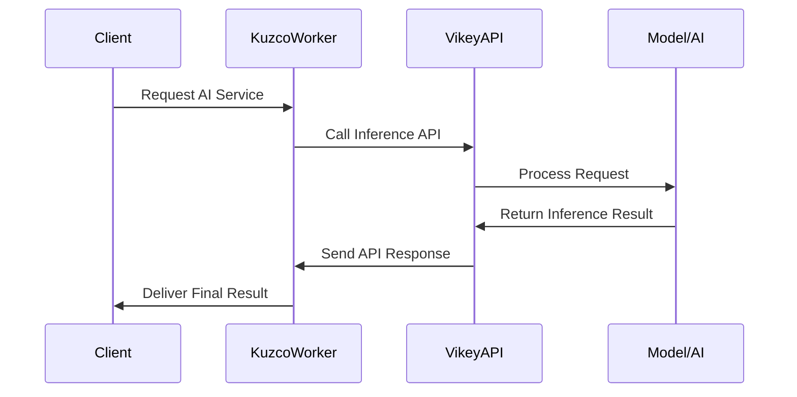
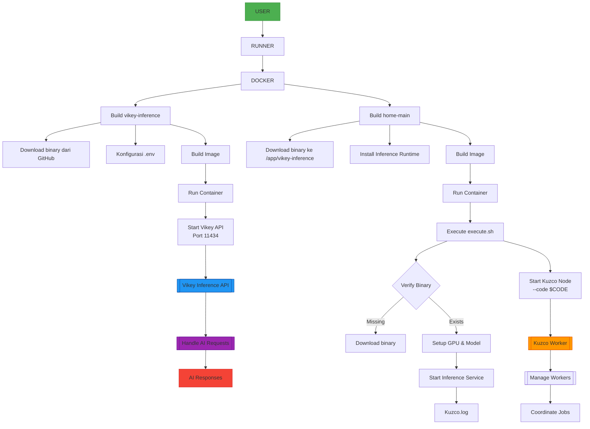

# A Comprehensive Guide - Running Kuzco Inference with CPU by API Proxy (Ollama or OpenAI)

## (1) Inferences System Data Sequence Diagram



## (2) Structure Directory of File

```diff
/kuzco-inference
├──.dockerignore
├──.ignore
│
├── /home
│   ├── .env
│   ├── .gitignore
│   ├── Dockerfile
│   ├── docker-compose.yaml
│   ├── ex.nginx-conf
│   ├── execute.sh
│   └── start.sh
│
├── /vikey-inference
│   ├── .env
│   ├── .gitignore
│   ├── Dockerfile
│   ├── docker-compose.yaml
│   ├── models.json
│   └── vikey-inference-linux            # File binary for linux
│
├── /dashboard                           # Web realtime monitoring (optional)
│   ├── Dockerfile
│   ├── docker-compose.yaml
│   ├── extract_log.py
│   ├── index.html                       # Homepages (access ip-server:port)
│   ├── monitor_server.py
│   └── inference_results.json
│
└── README.md
```

---

## Initial Requirements

| Requirement     | Minimum                |
| :----------     | :--------------------  |
| **Linux**       | Ubuntu 20 - 22 - 24 LTS          |
| **Mac**         | Chip M1, M2, M3, M4              |
| **CPU**         | vCores 8 with 8GB RAM - more     |      
| **STORAGE**     | Up 50GB - 99GB - more spaces     |

## Dashboard Registration

### Register and Obtain an API Key
- Visit the dashboard & sign up using an email:
- Navigate to the `API-KEYS` section.
- Create a new key `wsk-xxx` **SAVE SAVE SAVE**
- Copy the key you can create multiple keys, **if forget save generate again**
- 
## Clone Repository

```bash
git clone https://github.com/arcxteam/kuzco-inference.git
```

## Config Account

Copy .env from example
```bash
cp .env.example .env
```
Edit `.env`:
```
nano .env
```

## Flowchart Distribution


