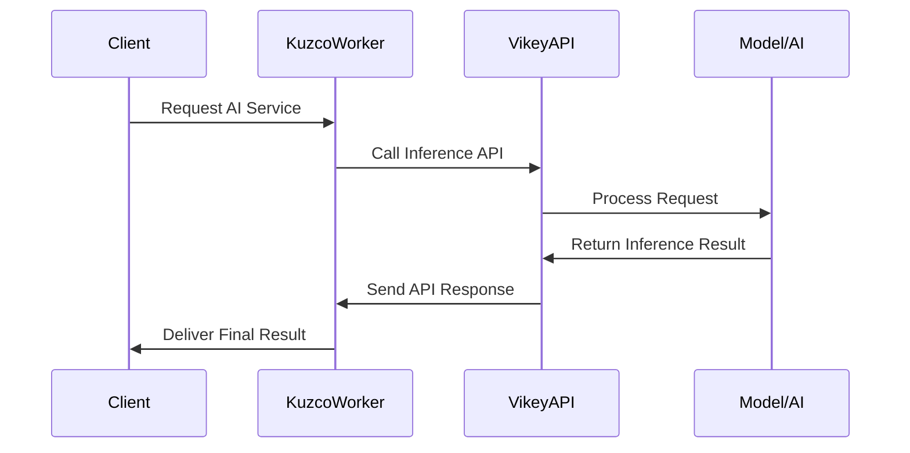

# A Comprehensive Guide - Running Kuzco Inference with CPU by API Proxy (Ollama or OpenAI)


## (1) Inferences System Data Sequence Diagram



## (2) Structure Directory

```diff
/kuzco-inference
├──.dockerignore
├──.ignore
│
├── /home
│   ├── .env
│   ├── .gitignore
│   ├── Dockerfile
│   ├── docker-compose.yaml
│   ├── ex.nginx-conf
│   ├── execute.sh
│   └── start.sh
│
├── /vikey-inference
│   ├── .env
│   ├── .gitignore
│   ├── Dockerfile
│   ├── docker-compose.yaml
│   ├── models.json
│   └── vikey-inference-linux            # File binary for linux
│
-├── /dashboard                          # Realtime monitoring run (optional)
│   ├── Dockerfile
│   ├── docker-compose.yaml
│   ├── extract_log.py
│   ├── index.html                       # Homepage (check preview)
│   ├── monitor_server.py
│   └── inference_results.json
│
└── README.md
```

## (3) Preview/Demo Kuzco Inference Homepage

> [!NOTE]
> Check preview homepage if need run (realtime) by own-localthost [Kuzco Inference Dashboard](https://arcxteam.github.io/kuzco-inference/dashboard/)

---

## A. SETUP FOR ACCOUNT

### 1. Initial Requirements

| Requirement     | Details                |
| :----------     | :--------------------  |
| **Linux**       | Ubuntu 20 - 22 - 24 LTS          |
| **CPU**         | vCores 8 with 8GB RAM - more     |      
| **STORAGE**     | Up 50GB - more spaces            |
| **API PROXY**   | Support LLM Ollama & OpenAI      |
| **PORT**        | Open 11434 (Official API Proxy)  |
|                 | Open 14444 (Official API Kuzco)  |
|                 | Open 5050 (Custom for Dashboard) |

### 2. Registration Kuzco Inference

**Obtain correct CLI WORKER**
- Sign up here https://devnet.inference.net/register
- Navigate to [create worker](https://devnet.inference.net/dashboard/workers/create)
- Create up to you `Worker Name` → `CLI` → `Create Worker`
- Click your `Worker Name` → click `Instance` and `Launch worker` → in section Step 2: Run an instance of this worker `COPY YOUR CODE`

### 3. Registration for API Proxy
**Note, use Vikey AI**
- Need API-KEY w/ compatible format Ollama or OpenAI (LLM)
- I use `VikeyAI` for default Kuzco model `llama-3.2-3b-instruct` & more models <mark>Rp.3000-5000/1M Tokens ~ $0.2-$0.3/1M Tokens</mark>
- Readme here for detail use [bahasa indonesia](https://github.com/arcxteam/kuzco-inference/blob/main/VIKEY-ID.md)
- Readme here for detail use [languange english](https://github.com/arcxteam/kuzco-inference/blob/main/VIKEY-EN.md)

## B. SETUP FOR CONFIGURATION

### 1. Clone Repository

```bash
git clone https://github.com/arcxteam/kuzco-inference.git
```
> After completed all step above, final config for runnig here

- Setup directory `kuzco-inference/home/.env` **(Main Run Kuzco)**
- Setup directory `kuzco-inference/vikey-inference/.env` **(API Proxy Model Run)**
- Setup directory `kuzco-inference/dashboard` **(optional run if need realtime monitoring)**

### 2. Config Account (.env)

- First need running `API Proxy LLModel Running`
- Replace API KEY `VIKEY_API_KEY=vk-xxxxxxxxx`

```bash
cd kuzco-inference/vikey-inference && nano .env
```

```bash
docker compose up --build -d
```

- Seconds need running `Main Run Kuzco with official config Binary`
- Replace this `WORKER_CODE=xxxxxxx` and `WORKER_NAME=xxxxxx` and `VIKEY_API_KEY=vk-xxxxxx`
- Where do? worker code, worker name read above 


