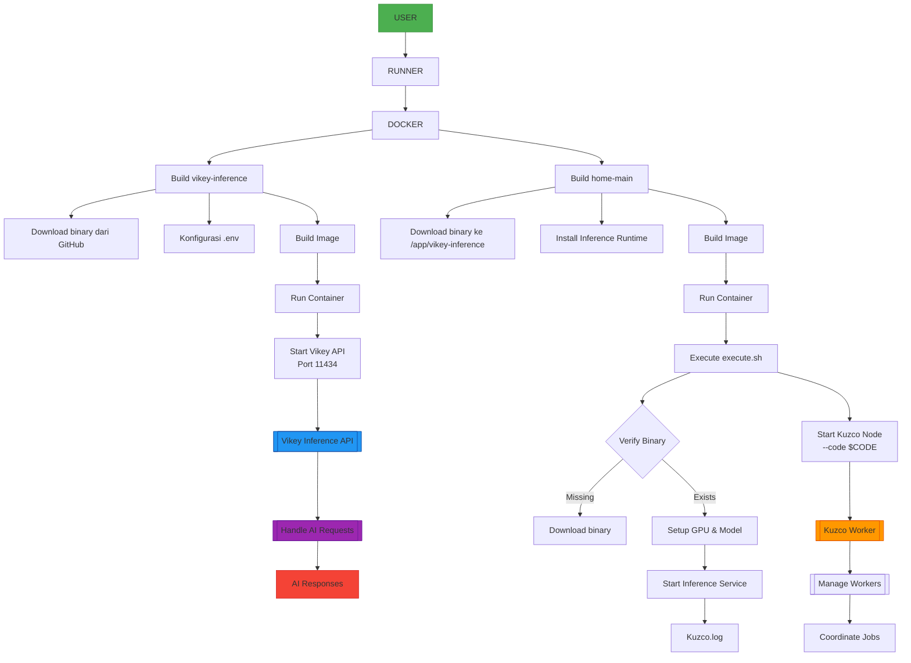

# A Comprehensive Guide - Running Kuzco Inference with CPU by API Proxy (Ollama or OpenAI)


## Inferences System Data Sequence Diagram


## Structure Directory of File

```diff
/kuzco-inference
├──.dockerignore
├──.ignore
│
├── /home
│   ├── monitoring/
│   │   ├── extract_log.py
│   │   ├── index.html
│   │   ├── monitor_server.py
│   │   └── inference_results.json
│
│   ├── .env
│   ├── .gitignore
│   ├── Dockerfile
│   ├── docker-compose.yaml
│   ├── ex.nginx-conf
│   ├── execute.sh
│   └── start.sh
│
├── /vikey-inference
│   ├── .env
│   ├── .gitignore
│   ├── Dockerfile
│   ├── docker-compose.yaml
│   ├── models.json
│   └── vikey-inference-linux            # File binary for linux
│
├── README.md
```

## Config Account

Copy .env from example
```bash
cp .env.example .env
```
Edit `.env`:
```
nano .env
```

## Flowchart Distribution


