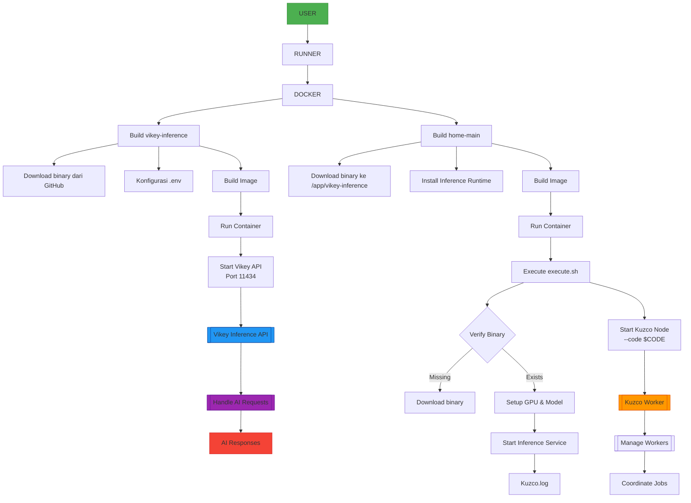

# Kuzco Inference - How to Use Vikey AI as an API Proxy for AI Model Training

### Yo Bruh, what's Vikey? Vikey.ai is a platform for managing AI API keys, giving you easy access to a bunch of top-tier AI models (LLMs) at affordable prices in Rupiah, with local support for Indonesian devs.

> [!NOTE]
> Bruh...Not tryna sell you anything, but if you wanna run this on a CPU, you can use a VPS with my method. Got some extra cash? Go rent a cloud GPU. Wanna just test it out? Top up a small amount for a trial. For Me? I’ve already dropped close to million Rupiah or ($100 ~ more) on this. If you wanna compare costs, try this method vs renting a GPU.

## What You Need
- Minimum top-up of Rp.10,000 or $0.60
- Cash in your bank account or
- Digital wallet balance like `OVO/GOPAY/BLU/DANA` or anything that supports QRIS as (QR-CODE PAYMENT)
- Payment options via `QRIS` or `BNI/MANDIRI/BRI Virtual Account`

## How to Sign Up
- Create an account with your email at `https://vikey.ai`
- Top up your balance at `https://vikey.ai/user/billing/topup`
- Generate an API key at `https://vikey.ai/user/api/keys/create`
- Check out the available AI models at `https://vikey.ai/user/models`

## What Do You Need & What Do You Get?
- All you need is a Vikey API key, something like `vk-sPvxxxxG1hxxxKyCse76xxx`
- Once you’ve got your API key, click its name to see the `API Key Details`
- Check your usage history with `API Key Usage History`—just click the API key you made, and you’ll see all the details, history, and more
- The dashboard is pretty slick, with full balance history, token usage (input/output), and you can even export stuff to PDF. Just poke around!

## List of LLM Models & Pricing on Vikey.ai

> The table below shows the available models, their IDs, prices, context windows, capabilities, and status. Prices are calculated **PER 1M TOKENS or 1 million tokens (mix of input/output)**. Prices are shown in Rp and USD (1 USD ≈ Rp 16,590).

| Model                                          | Model ID                           | Price (Rp/USD)         | Context Window | Capabilities                        | Status |
|------------------------------------------------|------------------------------------|-----------------------|----------------|-------------------------------------|--------|
| Qwen/QwQ-32B                                  | qwen-qwq-32b                      | Rp 13200 / $0.80      | 131,072        | text-generation, chat, summarization| Active |
| Qwen/Qwen2.5-Coder-32B-Instruct               | qwen2.5-coder-32b-instruct        | Rp 6600 / $0.40       | 131,072        | code-generation, code-completion, debugging | Active |
| Qwen/Qwen2.5-72B-Instruct                     | qwen2.5-72b-instruct              | Rp 13200 / $0.80      | 131,072        | text-generation, chat, reasoning+1 | Active |
| Deepseek/DeepSeek-V3                         | deepseek-v3                       | Rp 8250 / $0.50       | 128,000        | text-generation, chat              | Active |
| Meta-llama/Llama-3.3-70B-Instruct             | llama-3.3-70b-instruct            | Rp 13200 / $0.80      | 8,192          | text-generation, chat              | Active |
| Meta-llama/Llama-3.1-8B-Instruct             | llama-3.1-8b-instruct             | Rp 4000 / $0.24       | 4,096          | text-generation                    | Active |
| Meta-llama/Llama-3.3-70B-Instruct [ECONOMIC]  | llama-3.3-70b-instruct-economy    | Rp 5000 / $0.30       | 128,000        | text-generation                    | Active |
| Deepseek/DeepSeek-R1                         | deepseek-r1                       | Rp 66000 / $3.98      | 128,000        | text-generation                    | Active |
| Qwen/Qwen-2.5-7B-Vision-Instruct             | qwen2.5-7b-vision-instruct        | Rp 6600 / $0.40       | 125,000        | text-generation, vision            | Active |
| Google/Google-Gemma-3                        | gemma-3-27b-instruct              | Rp 17000 / $1.02      | 128,000        | text-generation                    | Active |
| Meta-llama/Llama-3.1-8B-Instruct [ECONOMIC]   | llama-3.1-8b-instruct-economy     | Rp 2000 / $0.12       | 4,096          | text-generation                    | Active |
| Meta-llama/Llama-3.2-8B-Instruct             | llama-3.2-8b-instruct             | Rp 2000 / $0.12       | 134,144        | text-generation, chat              | Active |
| Tinyllama/tinyllama1.1b                      | tinyllama1.1b                     | Rp 2000 / $0.12       | 4,096          | text-generation                    | Active |
| Quasar-Alpha                                  | quasar-alpha                      | Rp 2000 / $0.12       | 128,000        | text-generation                    | Active |
| Meta-llama/Llama-3.2-1B-Instruct             | llama-3.2-1b-instruct             | Rp 2000 / $0.12       | 16,000         | text-generation                    | Active |
| Meta-llama/Llama-3.1-8B-Instruct-fp8         | llama-3.1-8b-instruct-fp8         | Rp 2000 / $0.12       | 8,192          | text-generation, chat              | Active |
| Qwen/Qwen3-235B-A22B                         | qwen3-235b-a22b                   | Rp 16500 / $0.99      | 40,960         | text-generation, chat, coding      | Active |
| Google/Gemini-2.5-Flash-Preview-04-17        | gemini-2.5-flash-preview-04-17    | Rp 10000 / $0.60      | 1,048,576      | text-generation, chat              | Active |
| Meta-llama/Llama-3.2-3B-Instruct             | llama-3.2-3b-instruct             | Rp 5000 / $0.30       | 4,096          | text-generation, chat              | Active |
| Meta-llama/Llama-3.2-3B-Instruct [PROMO]     | llama-3.2-3b-instruct-promo       | Rp 3000 / $0.18       | 4,096          | text-generation, chat              | Active |
| openai/gpt-4.1                               | gpt-4.1                           | Rp 80000 / $4.82      | 32,768         | text-generation, vision, chat+1    | Active |
| openai/gpt-oss-20b                           | gpt-oss-20b                       | Rp 6000 / $0.36       | 4,096          | text-generation, coding, tool      | Active |

## What's up, bro?
- **Pricing**: Prices are in Indonesian Rupiah (Rp) and USD ($) per 1M tokens (input/output mix). Exchange rate used: 1 USD ≈ Rp 16,590,-
- Got questions or need help Top up Balances $1 ?
- Contact me at Telegram https://greyscope.xyz/x/telegram0xgrey
- Contact me at Discord https://greyscope.xyz/x/discord

## Dashboard Menu

## Flowchart Distribution

