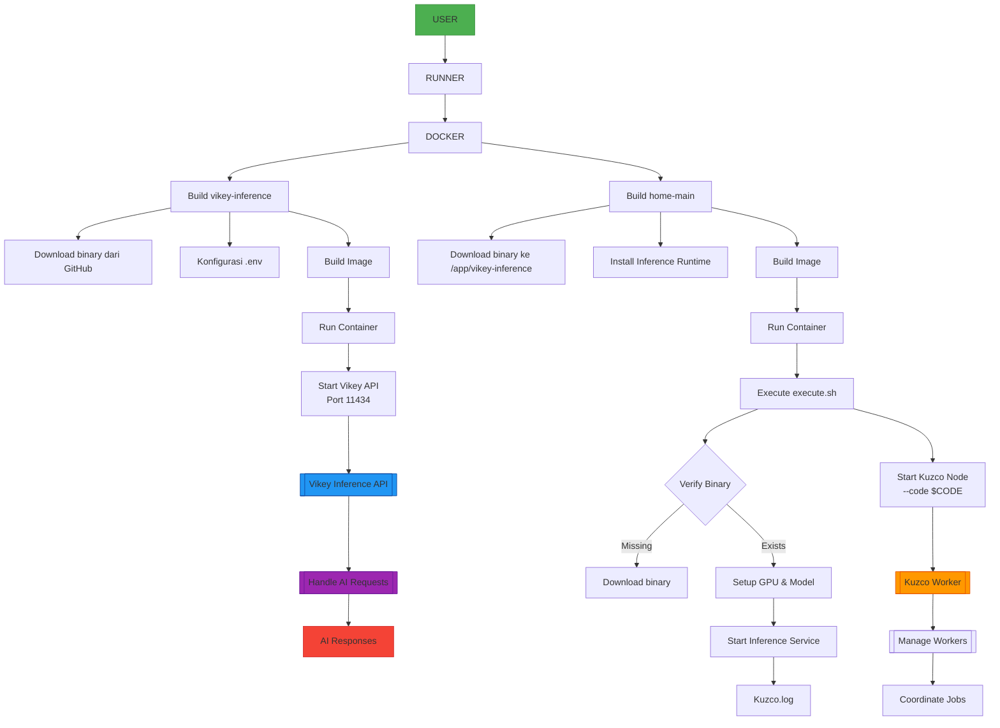

# Kuzco Inference - Bagaimana Bang Cara Menggunakan Vikey AI sebagai API Proxy Pelatihan Model AI

### Bang!! Apa itu Vikey? Vikey.ai adalah sebuah layanan platform manajemen API key AI yang menyediakan akses mudah ke berbabagai model AI (LLM) terbaik dengan harga terjangkau dalam Rupiah dan dukungan lokal untuk developer Indonesia.

> [!NOTE]
> Bukan ajakan, kalo mau running dengan CPU manfaatkan VPS bisa menggunakan metode saya ini atau jika ada duit lebih silakan rental GPU cloud atau mau coba coba silakan top up kecil buat testing saja. Kalo saya pribadi udah keluar duit hampir 1 juta pake ini, kalo mau dihitung sebagai perbandingan silakan di coba cara ini vs rental GPU.

## Syarat Kebutuhan
- Minimum top up Rp.10,000
- Saldo di rekening bank atau
- Saldo digital dompet `OVO/GOPAY/BLU/DANA` dll yang mendukung QRIS
- Opsi pembayaran lewat `QRIS` dan `BNI/MANDIRI/BRI Virtual Account`

## Daftar
- Daftar akun pake email `https://vikey.ai`
- Top up `https://vikey.ai/user/billing/topup`
- Buat API key `https://vikey.ai/user/api/keys/create`
- Cek berbagai model AI `https://vikey.ai/user/models`

## Apa saja yang di butuhkan dan didapatkan?
- Hanya butuh API key dari Vikey saja, misal `vk-sPvxxxxG1hxxxKyCse76xxx`
- Kalo sudah buat API key, klik sesuai nama yang dibuat akan terlihat `API Key Details`
- Cek penggunaan `API Key Usage History` klik aja api yang telah di buat, lengkap history dll
- Tampilan menu cukup lengkap, history saldo, cek hasil penggunaan token input/output bisa export pdf dll cek aja

## Daftar dan Harga LLM Models AI pada VikeyAi

> Tabel berikut model yang tersedia, model ai, harga, jendela konteks, kemampuan, dan status. Harga dibawah ini hitungannya adalah **PER 1M/TOKEN atau 1 juta tokens Mix input/output**

| Model                                          | Model ID                           | Price     | Context Window | Capabilities                        | Status |
|------------------------------------------------|------------------------------------|-----------|----------------|-------------------------------------|--------|
| Qwen/QwQ-32B                                  | qwen-qwq-32b                      | Rp 13200  | 131,072        | text-generation, chat, summarization| Active |
| Qwen/Qwen2.5-Coder-32B-Instruct               | qwen2.5-coder-32b-instruct        | Rp 6600   | 131,072        | code-generation, code-completion, debugging | Active |
| Qwen/Qwen2.5-72B-Instruct                     | qwen2.5-72b-instruct              | Rp 13200  | 131,072        | text-generation, chat, reasoning+1 | Active |
| Deepseek/DeepSeek-V3                         | deepseek-v3                       | Rp 8250   | 128,000        | text-generation, chat              | Active |
| Meta-llama/Llama-3.3-70B-Instruct             | llama-3.3-70b-instruct            | Rp 13200  | 8,192          | text-generation, chat              | Active |
| Meta-llama/Llama-3.1-8B-Instruct             | llama-3.1-8b-instruct             | Rp 4000   | 4,096          | text-generation                    | Active |
| Meta-llama/Llama-3.3-70B-Instruct [ECONOMIC]  | llama-3.3-70b-instruct-economy    | Rp 5000   | 128,000        | text-generation                    | Active |
| Deepseek/DeepSeek-R1                         | deepseek-r1                       | Rp 66000  | 128,000        | text-generation                    | Active |
| Qwen/Qwen-2.5-7B-Vision-Instruct             | qwen2.5-7b-vision-instruct        | Rp 6600   | 125,000        | text-generation, vision            | Active |
| Google/Google-Gemma-3                        | gemma-3-27b-instruct              | Rp 17000  | 128,000        | text-generation                    | Active |
| Meta-llama/Llama-3.1-8B-Instruct [ECONOMIC]   | llama-3.1-8b-instruct-economy     | Rp 2000   | 4,096          | text-generation                    | Active |
| Meta-llama/Llama-3.2-8B-Instruct             | llama-3.2-8b-instruct             | Rp 2000   | 134,144        | text-generation, chat              | Active |
| Tinyllama/tinyllama1.1b                      | tinyllama1.1b                     | Rp 2000   | 4,096          | text-generation                    | Active |
| Quasar-Alpha                                  | quasar-alpha                      | Rp 2000   | 128,000        | text-generation                    | Active |
| Meta-llama/Llama-3.2-1B-Instruct             | llama-3.2-1b-instruct             | Rp 2000   | 16,000         | text-generation                    | Active |
| Meta-llama/Llama-3.1-8B-Instruct-fp8         | llama-3.1-8b-instruct-fp8         | Rp 2000   | 8,192          | text-generation, chat              | Active |
| Qwen/Qwen3-235B-A22B                         | qwen3-235b-a22b                   | Rp 16500  | 40,960         | text-generation, chat, coding      | Active |
| Google/Gemini-2.5-Flash-Preview-04-17        | gemini-2.5-flash-preview-04-17    | Rp 10000  | 1,048,576      | text-generation, chat              | Active |
| Meta-llama/Llama-3.2-3B-Instruct             | llama-3.2-3b-instruct             | Rp 5000   | 4,096          | text-generation, chat              | Active |
| Meta-llama/Llama-3.2-3B-Instruct [PROMO]     | llama-3.2-3b-instruct-promo       | Rp 3000   | 4,096          | text-generation, chat              | Active |
| openai/gpt-4.1                               | gpt-4.1                           | Rp 80000  | 32,768         | text-generation, vision, chat+1    | Active |
| openai/gpt-oss-20b                           | gpt-oss-20b                       | Rp 6000   | 4,096          | text-generation, coding, tool      | Active |

## Bang udah bang?
- Harga ditampilkan dalam Rupiah (Rp) per 1 juta token (mix input/output) segono
- Contact gue Telegram https://greyscope.xyz/x/telegram0xgrey
- Contact gue Discord https://greyscope.xyz/x/discord

## Dashboard Menu

## Flowchart Distribution

